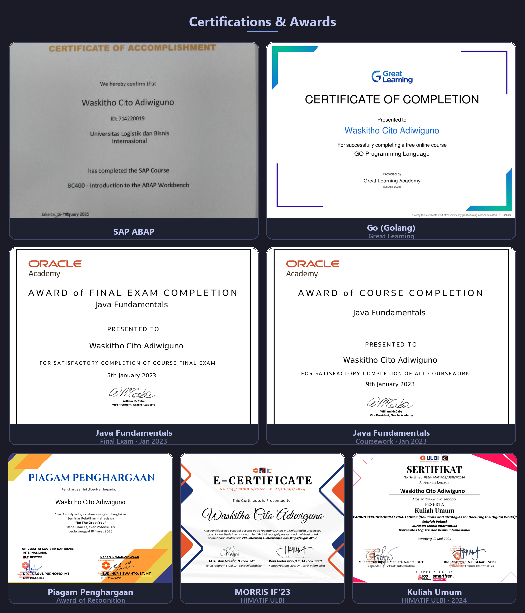

<!-- Typing animation -->

 

## 👨‍💻 About Me

- 🎓 D4 Informatics student, **Universitas Logistik dan Bisnis Internasional (ULBI)**, School of Information Technology
- 🔬 Research focus: **Explainable AI** (SHAP), **Fairness in ML** (AIF360), and **LLM** integration for HR analytics
- 🛠️ Building practical Python tools: data pipelines, desktop apps, and simulation systems
- 📄 Actively publishing in the **SINTA** journal ecosystem (Indonesia)
- 💼 Working on academic research, freelance data work, and applied ML development
- 📫 Open to collaboration on ML/AI, data science, and automation

## 🧰 Tech Stack

**🧠 AI & Data Science**

**🌐 Web & Applications**

**🛠️ Tools**

## Featured Projects

### ASM_AntonSahamManager

Modular AI-based stock trading simulation system with 6 modules: data layer (SQLite + yfinance), technical indicators (RSI/MACD/Bollinger/ATR), rule-based signal engine, ATR-based risk manager, paper trading simulator, and a Streamlit dashboard. Target markets: IDX, US stocks, and crypto.

`Python` `Streamlit` `yfinance` `TA-Lib`

### EXPLAINABLE HUMAN CAPITAL INTELLIGENCE FRAMEWORK

AI Employee Attrition Detector — predicts employee attrition risk and explains it: **10 models competed** (Logistic Regression won: ROC-AUC 0.799, Recall 0.596), **Platt-calibrated probabilities** (Brier 0.1578 → 0.1049), **per-employee SHAP waterfall**, and an **LLM (Llama 3.3 via Groq)** that turns SHAP numbers into tier-matched HR narratives, plus a **what-if simulation** for prescriptive analytics. · [📄 Project Detail Page →](https://waskithocitoadiwiguno.github.io/details.ExplainableHRIntelligence/) · [🔗 Repo →](https://github.com/WaskithoCitoAdiwiguno/details.ExplainableHRIntelligence)

`Python` `SHAP` `Scikit-learn` `Groq API` `Gradio`

###  UtangKu

App that helps user monitoring "WHO" of all the people who borrow a money from user, with an alarm setup, if user fill the phone number of the people who borrow money from him and set the deadline, the system will remind those person when the deadline of payment is up.

`Python` `Tkinter` `ctypes`

### DHCIP — Damri Human Capital Intelligence Platform

Web dashboard system for monitoring DAMRI employee performance, with 4 core modules: **Dashboard** (company-wide KPI summary), **Employee Details** (KPI, work attitude, attendance, 360° assessment), **Nine Box Matrix** (performance mapping across leader/division/directorate), and **AI Recommendation** (automated improvement suggestions via Gemini Flash 2.5). Live at [dhcip.my.id](https://dhcip.my.id/) · [Project Detail Page →](https://waskithocitoadiwiguno.github.io/details.DHCIP/index.html)

`JavaScript / TypeScript` `golang` `PHP` `CI` `Gemini API` `MySQL`

 

---

## 📞 Contact

- 📧 **Email:** [waskithocito.a@gmail.com](mailto:waskithocito.a@gmail.com)
- 💼 **LinkedIn:** [Waskitho Adiwiguno](https://www.linkedin.com/in/waskitho-adiwiguno-736a05271/)
- 📸 **Instagram:** [@waskitho___](https://instagram.com/waskitho___)

## 📄 CV / Resume

*CV/Resume section coming soon...*

## 📚 Publications

### Journals

1. **Artificial Intelligence for Talent Classification in Digital Human Resource Management: A Systematic Literature Review**
   - 📖 Published in: *Telematika* (E-ISSN: 2242-4528), SINTA 2 Accredited
   - 🔗 [Link to publication](https://ejournal.amikompurwokerto.ac.id/index.php/telematika)
   - 📄 Status: **Accepted (LoA received)** - August 2026
   - 👥 Co-author: Roni Andarsyah

2. **Illogical Analysis: The Reasons Why Implementation of Machine Learning (Case Study: R&D Analysis on Machine Learning Implementation in CV. Maju Sentosa)**
   - 📖 Published in: *ILKOM Jurnal Ilmiah Teknkologi Komputer dan Informatika* (ISSN: 2541-0807)
   - 🔗 [Link to publication](https://journal.fkom.uniku.ac.id/ilkom/article/view/343)
   - 👥 Authors: Waskitho Cito Adiwiguno, Roni Andarsyah

### Books

1. **Pengenalan Golang dan Membuat Package**
   - 📖 Published via: Penerbit Buku Pedia (available on Google Books), July 2023, 104 pages
   -  This book was made to 
   - 🔗 [Link to book](https://books.google.co.id/books?id=HNzLEAAAQBAJ)
   - 👥 Co-authors: Muhammad Wildan Khalilurrahman, Rolly Maulana Awangga

## 🏅 Certifications & Awards

<picture>
  <source media="(prefers-color-scheme: dark)" srcset="assets/certificates-dark.png" />
  <source media="(prefers-color-scheme: light)" srcset="assets/certificates-light.png" />
  
</picture>

📋 <b>Daftar sertifikat / Certificate list</b>

| # | Certificate | Issuer / Context | Date |
|---|---|---|---|
| 1 | BC400 — Introduction to the ABAP Workbench | SAP (via ULBI) | Feb 2025 |
| 2 | GO Programming Language | Great Learning Academy | May 2025 |
| 3 | Java Fundamentals — Final Exam Completion | Oracle Academy | Jan 2023 |
| 4 | Java Fundamentals — Coursework Completion | Oracle Academy | Jan 2023 |
| 5 | Piagam Penghargaan (Award of Recognition) | Polres Cimahi | Feb 2022 |
| 6 | MORRIS IF'23 — Seminar Participant | HIMATIF ULBI | Jan 2024 |
| 7 | Kuliah Umum — Public Lecture | HIMATIF ULBI | May 2024 |

---

## 📊 GitHub Stats

 

 

 

## 📈 Contribution Activity

## 🐍 Snake Game

<picture>
  <source media="(prefers-color-scheme: dark)" srcset="https://raw.githubusercontent.com/WaskithoCitoAdiwiguno/WaskithoCitoAdiwiguno/output/github-contribution-grid-snake-dark.svg" />
  <source media="(prefers-color-scheme: light)" srcset="https://raw.githubusercontent.com/WaskithoCitoAdiwiguno/WaskithoCitoAdiwiguno/output/github-contribution-grid-snake.svg" />
  
</picture>

## 🏆 Trophies

## 💭 Random Dev Quote

 

